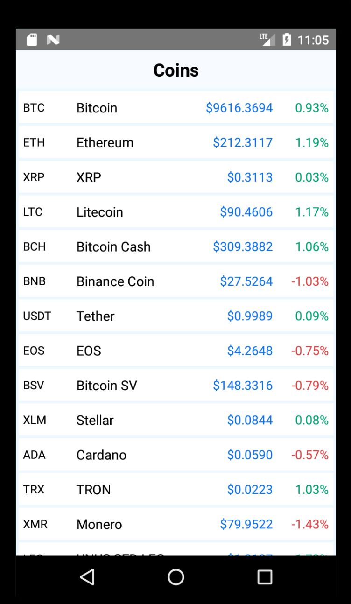

# Coin Market App

An application for browsing data from [coinmarketcap](https://coinmarketcap.com/).

# Tech Stack
1. [Typescript](https://www.typescriptlang.org/) for confidence  
2. [React Native](https://facebook.github.io/react-native/) with [Hooks](https://reactjs.org/docs/hooks-overview.html)  
3. [Mobx](https://mobx.js.org/) with [Hooks bindings](https://github.com/mobxjs/mobx-react-lite) for state management  
4. [Axios](https://github.com/axios/axios) for http requests  
5. [Jsonous](https://kofno.github.io/jsonous/) for safe response decoding

# TODO
1. Add tests with react-native-testing-library
2. Show coins Icons
3. Switch base currency (default: USD)
4. Refresh Button in the header?
5. Click on coin: open coin profile
6. Run on iOS: there is a problem with ios simulator
7. refactor make request: return Result, stop throwing errors

# Screenshots

